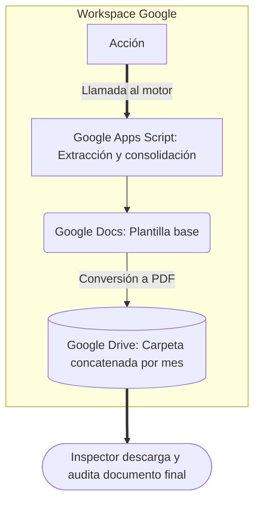

```mermaid
flowchart TD
    subgraph Workspace [Workspace Google]
        Acción ==>|Llamada al motor| script[Google Apps Script: Extracción y consolidación]
        
        script --> docs(Google Docs: Plantilla base)
        docs -->|Conversión a PDF| drive[(Google Drive: Carpeta concatenada por mes)]
    end

    %% entrega final
    drive ==> fin([Inspector descarga y audita documento final])
    
```