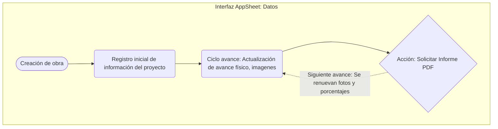

```mermaid
flowchart TD

%% contenedores de herramientas y responsabilidades

subgraph AppSheet [Interfaz AppSheet: Datos]

inicio([Creación de obra]) --> setup(Registro inicial de información del proyecto)

setup --> ciclo(Ciclo avance: Actualización de avance físico, imagenes)

ciclo --> accion{Acción: Solicitar Informe PDF}

accion -.->|Siguiente avance: Se renuevan fotos y porcentajes| ciclo

end
```

